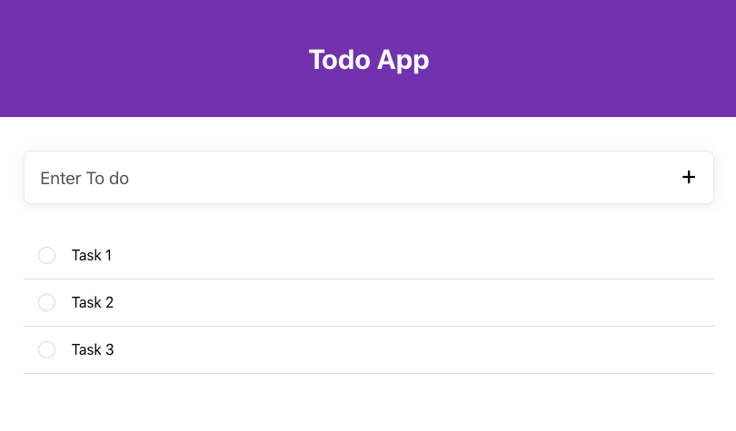

## Todo App

Simple Todo App with react. https://todo.pquinteros.now.sh/

 

  

### `npm start`

Runs the app in the development mode. 
Open [http://localhost:3000](http://localhost:3000) to view it in the browser.

The page will reload if you make edits. 
You will also see any lint errors in the console.

